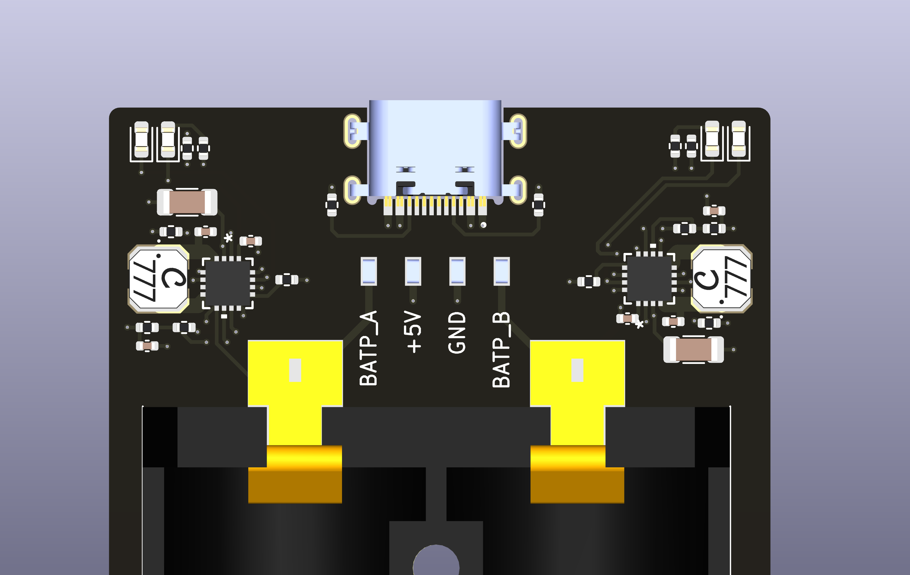
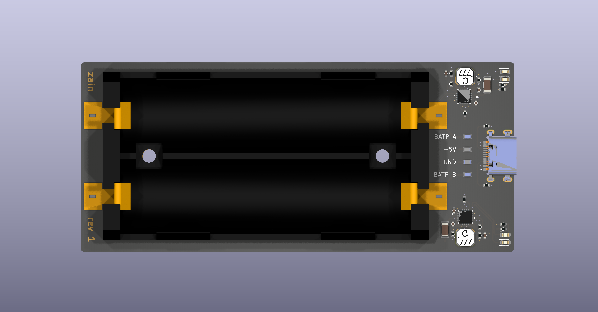
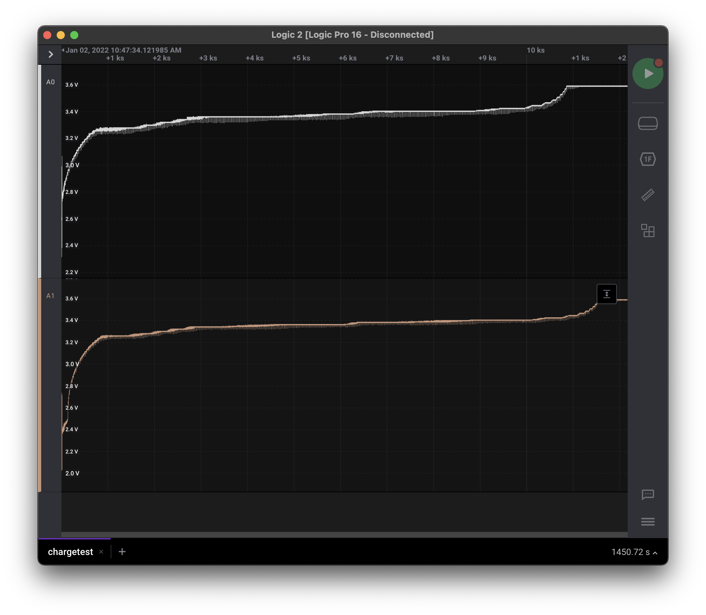

# 18650-charger
Dual channel USB-C LiFeP04 18650 charger based on 2x LTC4121 with two independant channels. Fully charged voltage is set to 3.6V at a current of 400mA.

## Images

## Test results from charging two cells
Capture from a Saleae logic analyzer. See the data file [here](doc/chargetest.sal)
